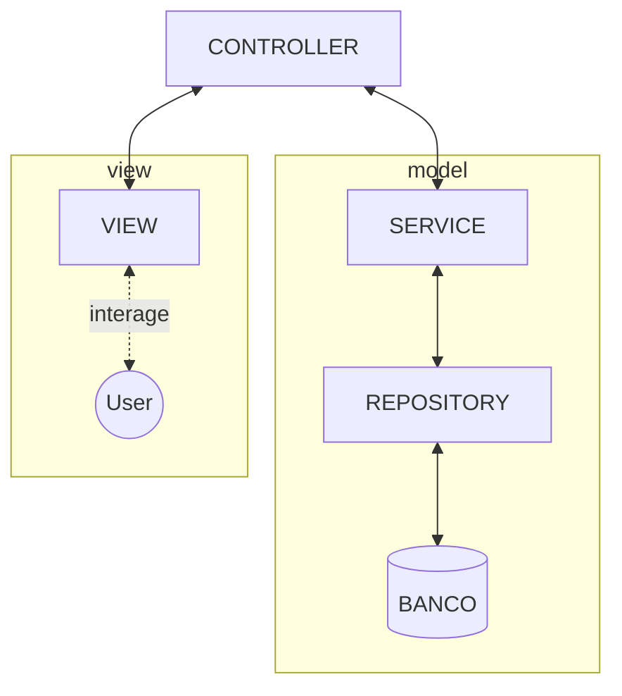

# Review Spring Framework

## O que é o Spring Boot?

## MVC o que é, onde vice e do que se alimenta?

```mermaid
flowchart TB
    REPOSITORY
    SERVICE
    CONTROLLER <--> SERVICE
    subgraph model
    SERVICE <--> REPOSITORY
    REPOSITORY <--> db
    end
    
    CONTROLLER <--> VIEW
    subgraph view
    VIEW <-.interage.-> user
    end
    user((User))
    db[(BANCO)]
    VIEW
    
```